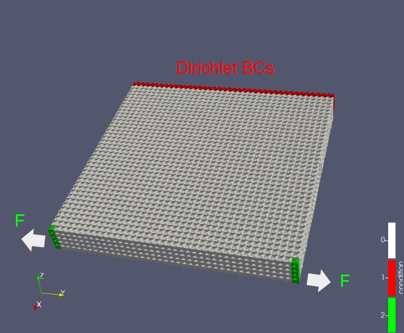
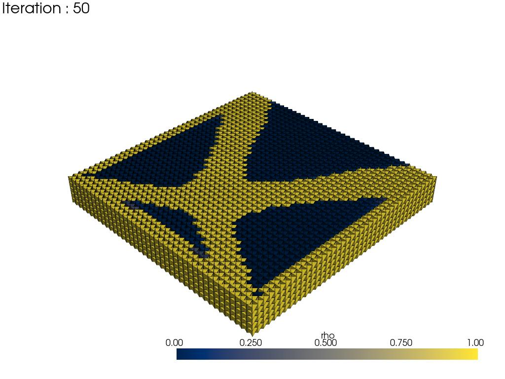

Tutorial Page
===============

Optimization
-----------------

Below is a minimal working example that performs a topology optimization.
This will run a compliance minimization with OC method.

Optimizer Configuration, and Run
~~~~~~~~~~~~~~~~~~~~~~~~~~~~~~~~~~~~

.. code-block:: python

   import sktopt

   cfg = sktopt.core.optimizers.LogMOC_Config(
        vol_frac=vol_frac=sktopt.tools.SchedulerConfig.constant(
            target_value=0.6
        ),
        max_iters=40,
        record_times=40,
        export_img=True
    )
    optimizer = sktopt.core.LogMOC_Optimizer(cfg, mytask)
    optimizer.parameterize()
    optimizer.optimize()

But before running the optimization, we need to set up the task configuration and the design variables.

Task Definition
-----------------

Shape modeling and its basis function
~~~~~~~~~~~~~~~~~~~~~~~~~~~~~~~~~~~~~~~~~~~~

.. code-block:: python

    import skfem
    import sktopt

    x_len = 8.0
    y_len = 8.0
    z_len = 1.0
    mesh_size = 0.2

    mesh = sktopt.mesh.toy_problem.create_box_hex(
        x_len, y_len, z_len, mesh_size
    )
    e = skfem.ElementVector(skfem.ElementHex1())
    basis = skfem.Basis(mesh, e, intorder=2)

Load Basis from Model File 
~~~~~~~~~~~~~~~~~~~~~~~~~~~~~~~~~~~~~~~~~~~~

.. code-block:: python

    import skfem
    import sktopt

    mesh_path = "./data/model.msh"
    basis = sktopt.mesh.loader.basis_from_file(mesh_path, intorder=3)

Task Configuration
~~~~~~~~~~~~~~~~~~~~

.. code-block:: python

    dirichlet_in_range = sktopt.mesh.utils.get_points_in_range(
        (0.0, 0.05), (0.0, y_len), (0.0, z_len)
    )
    dirichlet_facets = basis.mesh.facets_satisfying(
        dirichlet_in_range, boundaries_only=True
    )
    dirichlet_dir = "all"

    eps = mesh_size
    in_range_0 = sktopt.mesh.utils.get_points_in_range(
        (x_len, x_len), (y_len-eps, y_len), (0, z_len)
    )
    in_range_1 = sktopt.mesh.utils.get_points_in_range(
        (x_len, x_len), (0, eps), (0, z_len)
    )
    force_facets_0 = basis.mesh.facets_satisfying(
        in_range_0, boundaries_only=True
    )
    force_facets_1 = basis.mesh.facets_satisfying(
        in_range_1, boundaries_only=True
    )
    force_dir_type = ["u^2", "u^2"]
    force_value = [-100, 100]
    design_in_range = sktopt.mesh.utils.get_points_in_range(
        (0.0, x_len), (0.0, y_len), (0.0, z_len)
    )
    design_elements = mesh.elements_satisfying(design_in_range)

    E0 = 210e9
    mytask = sktopt.mesh.task.TaskConfig.from_facets(
        E0,
        nu,
        basis,
        dirichlet_facets,
        dirichlet_dir,
        [force_facets_0, force_facets_1],
        force_dir_type,
        force_value,
        design_elements
    )

Results and Visualization
-----------------------------

Results and Visualization
~~~~~~~~~~~~~~~~~~~~~~~~~~~~~

The results of the optimization are stored in the directory specified by cfg.dst_path.
For example, it contains visualizations of the density distribution, as well as graphs showing the evolution of various parameters during the optimization process, such as the density field, volume fraction, and sensitivity values.

.. raw:: html

   <video width="640" height="360" controls>
     <source src="_static/animation-box-rho.mp4" type="video/mp4">
     Your browser does not support the video tag.
   </video>