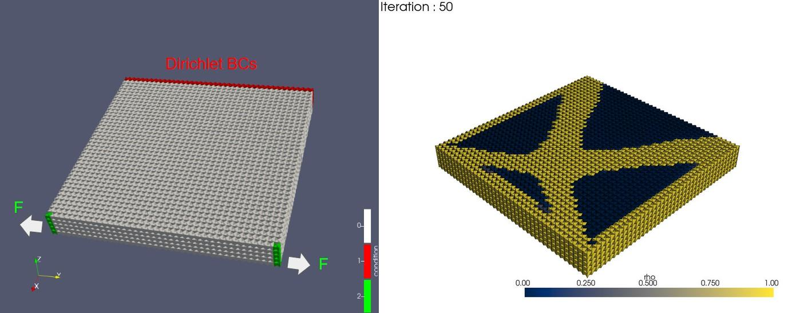
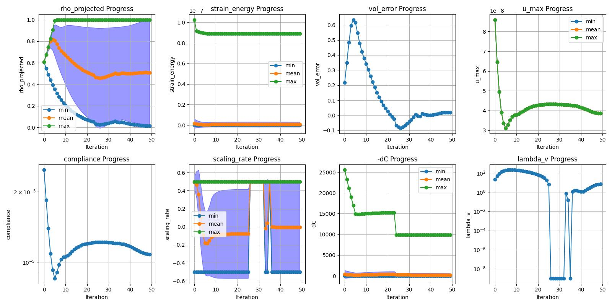

## Summary

Topology optimization is a computational method for optimizing the shape and material layout of structures and components, typically using the finite element method (FEM). It automatically generates optimal structural configurations by adjusting the distribution of material to achieve target performance—for example, minimizing compliance under a volume constraint. Specifically, the method optimizes an objective function by adjusting design variables that represent the presence or absence of material in each region.

This technique can be applied to a wide range of physical simulations, including structural analysis, heat conduction, fluid dynamics, and electromagnetic field analysis, making it a powerful tool for optimal design.

Scikit-topt is a Python library that implements topology optimization algorithms. It provides tools for visualizing parameter transitions and optimization results, thereby facilitating algorithm tuning and comparative analysis of optimization strategies. The library is tested via GitHub Actions and includes documentation generated with Sphinx.
Installation and usage instructions are available in the [GitHub repository](https://github.com/kevin-tofu/scikit-topt).

This article describes version **v0.1.4** of *scikit-topt*.


## Statement of Need

There is a growing demand for accessible and flexible tools for topology optimization that support unstructured meshes and can be easily integrated into Python-based workflows.
While many existing libraries focus on specific problems with rigid architectures or heavy dependencies, Scikit-topt offers a lightweight, modular, and fully Pythonic framework suitable for both academic research and industrial applications.

In topology optimization, the evolution of material density fields and the scheduling of algorithmic parameters (e.g., via continuation methods) play a crucial role in achieving high-quality results. However, most existing libraries provide limited or no support for managing and visualizing such transitions, making it difficult to interpret the optimization process.

Scikit-topt addresses this gap by enabling users to track and visualize the progression of density distributions and parameter schedules throughout the optimization process. This feature is particularly valuable for algorithm development, comparative studies, and educational purposes.

The project is under active development and welcomes community contributions.


## Purpose and Prior Art

There are numerous open-source projects for topology optimization.
Examples include FEniTop[@jia_fenitop_2024], TopOpt.jl[@tarek2019topoptjl], Topology optimization using PETSc[@Smit2021], DL4TO[@dl4to2023], and pytopo3d[@kim2025pytopo3d].
However, many projects are specialized implementations targeted at specific problems and are not well-suited for solving general topology optimization tasks. Common limitations include:

* Parameters and problem settings are hard-coded, limiting flexibility.
* They rely on grid- or voxel-based finite element analysis, making it difficult to handle arbitrary geometries.
* They are not packaged properly or depend on outdated software, making installation and usage difficult.
* They are not designed as standard experimental platforms, making it hard to compare algorithms across different parameters and case studies.

Scikit-topt avoids these issues by not including compiled code and depending only on Scipy[@scipy], a widely used and stable Python library, making packaging and installation straightforward.
For finite element matrix assembly, it uses Scikit-FEM[@skfem], which also contains no compiled components.

Furthermore, Scikit-topt visualizes parameter transitions and material density evolution through Matplotlib[@hunter2007] and PyVista[@sullivan2019pyvista].

Scikit-topt implements topology optimization algorithms based on the density method, and currently supports the following features:


* Structural analysis and topology optimization using unstructured meshes
* Optimization based on the density method (SIMP / RAMP)
* Binarization acceleration using Heaviside projection
* Smoothing using the Helmholtz filter
* Gradient computation via backpropagation, combining the density method, Heaviside projection, and Helmholtz filter
* Optimization under multiple load cases
* Continuation for scheduling parameter transitions
* Includes FEA solvers powered by:
  - Scipy[@scipy]
  - PyAMG[@pyamg]
  - scikit-fem[@skfem]
* Support for multiple optimization algorithms
  - Optimality Criteria Method
  - Modified Optimality Criteria (MOC) Variants
    - Log-space Update
    - Linear-space Update
  - Lagrangian Method


## Usage Example

The following example demonstrates how to use Scikit-topt to perform topology optimization on an unstructured mesh using the Optimality Criteria (OC) method.

First, a mesh is loaded using `scikit-fem`, and a `TaskConfig` object is defined with material properties and boundary conditions.  
Next, a configuration object for the optimizer is created, and the optimization process is launched.

In this example, a `TaskConfig` is created from a mesh file using `scikit-fem`, which defines the FEM model, material properties, and boundary conditions.  
Then, `OC_Config` sets the optimization parameters such as volume fraction and iteration limits. Finally, the optimizer is executed.

```python

import skfem, scitopt

mesh_path = "./data/model.msh"
basis = scitopt.mesh.loader.basis_from_file(mesh_path, intorder=2)

task = scitopt.mesh.task.TaskConfig.from_defaults(
    210e9, 0.30, basis, dirichlet_nodes...
)
cfg = scitopt.core.OC_Config(
    dst_path="./result",
    vol_frac=0.4,
    max_iter=100...
)

optimizer = scitopt.core.OC_Optimizer(cfg, task)

optimizer.parameterize()
optimizer.optimize()
```

During the optimization process, intermediate density fields are automatically visualized and saved using PyVista and Matplotlib.  
This enables users to monitor the convergence behavior and spatial evolution of the material distribution.

An example is shown below. The left figure shows the boundary conditions, while the right shows the optimized density distribution:


{ width=80% }

{ width=80% }

As an extensible and open framework, Scikit-topt aims to facilitate reproducible experimentation and accelerate the development of new topology optimization strategies.
